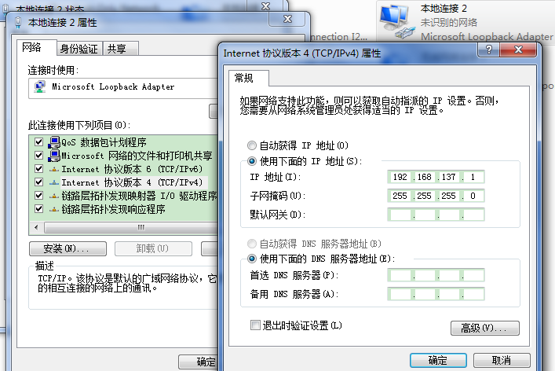
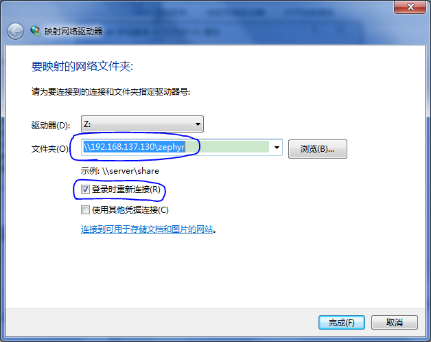
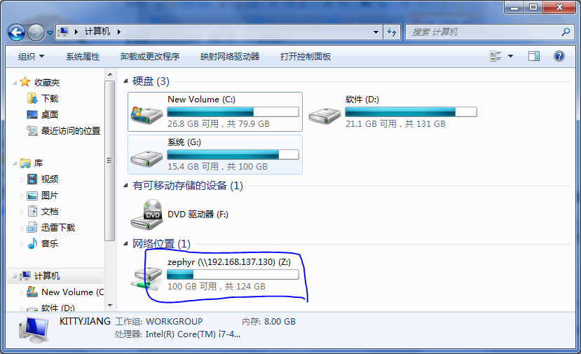

# 搭建开发环境 - 懒人版

　　鉴于很多朋友都是在 windows 下玩嵌入式，不熟悉 Linux 环境的搭建、配置过程，却又挡不住对 Zephyr 的强烈好奇心，因此我搭建好了一个现成的 Zephyr 环境，上传到百度云。如果一切顺利的话，下载完成后，十分钟就能体验 Zephyr 了。

　　懒人版主要集成的功能：
- 安装 Ubuntu-16.04-desktop-i386
- 更新软件源为阿里(目前国内最快速的源)
- 安装 virtualbox 客户端增强功能
- 安装、配置 Git(部分功能)
- 安装、配置 vi(简易配置)
- 安装、配置 samba 服务
- 安装、配置 ssh/telnet 服务
- 设置双网卡、固定 IP 地址
- 配置 Zephyr 开发环境

　　虚拟机的用户名是 zephyr，密码是一个空格。
 
　　下载地址：[http://pan.baidu.com/s/1hsiHBjI](http://pan.baidu.com/s/1hsiHBjI)(提取码 zdj2)

## 安装 Loopback 网卡

　　先按下面的步骤安装回环网卡：

- 打开设备管理利器：计算机(右键)->管理->设备管理器
- 然后在菜单中选择：操作->添加过时硬件
- 然后在弹出的向导中：下一步->安装我手动从列表选择的硬件(高级)->下一步->网络适配器->下一步
- 在产商中选择 Microsoft，在适配器列表中选择 Microsoft Loopback Adapter
- 然后一直下一步，直道完成。

　　再到网络共享中心中将该网卡的 ipv4 地址设置为 192.168.137.1，子网掩码设置为 255.255.255.0，如下图：

<center> </center>

## 安装 virtualbox

　　这里是以 virtualbox 创建的虚拟机，所以推荐你也使用 virtualbox，这样能减少后面的配置步骤。

　　相关文件：VirtualBox-5.1.12-112440-Win.exe

　　具体安装过程略。

## 安装 virtualbox 扩展功能

　　相关文件：Oracle_VM_VirtualBox_Extension_Pack-5.1.12-112440.vbox-extpack

　　virtualbox 扩展功能必须在安装完 virtualbox 后才能安装。双击该文件即可安装，具体安装过程略。

## 打开虚拟机

　　相关文件：zephyr-ubuntu.zip

　　将 zephyr-ubuntu.zip 解压后，直接双击 zephyr.vbox 打开该虚拟机。

## 编译 Zephyr

　　登录进 Ubuntu 后，打开终端，依次执行：

- cd ~/samba/zephyr
- source zephyr-env.sh
- cd samples/hello_world/
- make BOARD=qemu_x86 qemu 

## 可选功能

### 映射网络驱动

　　映射网络驱动后，你可以像访问本地磁盘文件一样地访问所配置的 samba 目录下的所有文件。
 
> 前提条件：你的 windows 能与虚拟机相互 ping 通。我已经为虚拟机设置了双网卡，其中一个网卡为 NET 模式，主要用于虚拟机内部访问互联网，另一个网卡为桥接模式，主要用于与主机通信，其 IP 已固定设置为 192.167.137.130。
 
　　具体步骤：
- 计算机(右键)->映射网络驱动器
- 选择一个驱动器，并在 文件夹 文本框中输入 \\192.168.137.130\zephyr，然后勾选上 “登录时重新连接” 复选框，然后点击完成。
- 在弹出的登录界面中，输入 samba 账户的用户名(smbuser)和密码(一个空格)。最终效果如下图：

<center> </center>
<center> </center>


### 用 SecureCRT 登录虚拟机

　　相关文件：SecureCRT.zip

　　解压 SecureCRT.zip 后，双击打开 SecureCRT.exe，里面已经默认配置了对虚拟机的 ssh 连接，直接“连接”即可。

　　虚拟机的图形界面比较占用资源，如果你的 PC 配置不是足够的高，建议关闭图形化界面，相关命令：
```
# 设置默认从命令行启动
$ sudo systemctl set-default multi-user.target
# 设置默认从图形化桌面启动
$ sudo systemctl start lightdm  
```
