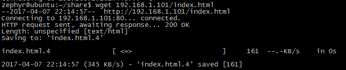
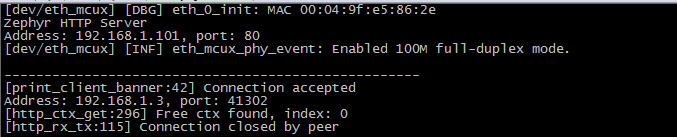
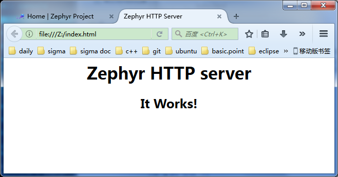

# 实验 - HTTP 服务器

本实验主要演示开发板如何与 PC 机通过 HTTP 协议进行通信。在该实验中，我们将开发板作为 HTTP 服务端，在 Ubuntu 中通过 wget 命令向板子发送 HTTP 请求，板子则对 HTTP 请求进行响应 —— 返回一个 html 网页。

## 编译 & 烧写

进入 http_server 所在目录：
```
$ cd samples/net/http_server 
$ make BOARD=frdm-k64f
```
编译完成后，生成的镜像文件位于`samples/net/http_server/outdir/frdk-k64f/zephyr.bin`，将其烧写到开发板上面。

## 环境准备

基本与 [实验 - ping]() 的过程一致，只是由于本实验中的开发板默认 IP 是 192.168.1.101，可以做如下一种改动：
- 将开发板默认的 IP 改回为 192.0.2.1。直接修改改示例下面的配置文件 `src/config.h` 即可。
- 将 PC 机和 虚拟机对应网卡的 IP 地址重新设置为 192.168.1.xxx 网段的固定值。

## 实验现象

按照上一步准备好后，给开发板复位，然后在虚拟机里面执行如下命令向板子发送 HTTP 请求：
```
wget 192.168.1.101/index.html
```

<center></center>

<center>图：发送 HTTP 请求并得到响应</center>

板子收到请求后，回做相应的响应。串口打印的消息为：

<center></center>

<center>图：串口的打印</center>

当 wget 命令接收到板子的响应后，回接收到一个 html 文件 `index.html`，我们可以用浏览器打开该文件：

<center></center>

<center>图：index.html</center>

## 总结

虽然只是一个小小的 demo，但是我们已经能看到 Zephyr 的强大了 :heart_eyes: