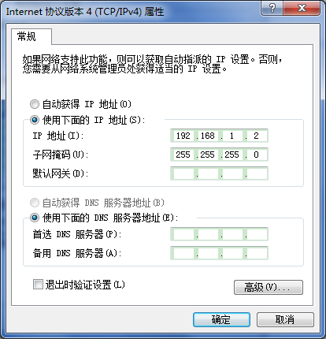
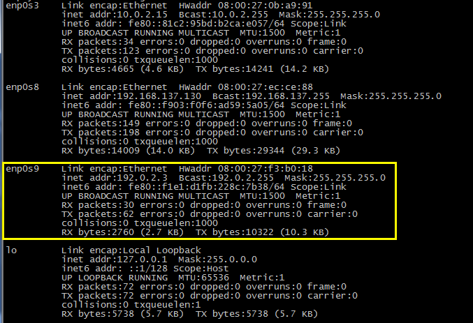

# 实验 - ping

本实验主要演示开发板如何与 PC 机通过网络进行通信。在该实验中，我们将开发板作为 ping 服务端，将 PC 作为客户端，即从 PC 上 ping 开发板。

期望的实验现象：
- 从 Windows 能够 ping 通开发板
- 从 Ubuntu  能够 Ping 通开发板

## 编译 & 烧写

进入 echo_server 所在目录：
```
$ cd samples/net/echo_server 
$ make BOARD=frdm-k64f
```
编译完成后，生成的镜像文件位于`samples/net/echo_server/outdir/frdk-k64f/zephyr.bin`，将其烧写到开发板上面。

## 环境准备

直接用网线将 PC 机与 frdm-k64f 的以太网口直连，并将 PC 机的有线网卡的 IP 设置为固定值 192.0.2.2，子网掩码设置为 255.255.255.0，如下图所示：

<center></center>

<center>图：设置 Windows 以太网卡的固定 IP</center>


按照上面的方式设置好后，PC 机就可以 ping 通开发板了，但是如果希望虚拟机里面也能 ping 通板子，则还需要做额外的设置，保证 PC 机和虚拟机能通过**以该 PC 的以太网卡桥接的方式**相互 ping 通，然后在虚拟机里面将系统识别出来的**该网卡**设备的 IP 设置为固定值 192.0.2.3，如下图所示：

<center></center>

<center>图：设置 Ubuntu 对应网卡的固定 IP</center>

> PC 和虚拟机的 IP 地址一定要设为固定值，且让 PC、虚拟机和板子三者的 IP 在同一网段。在这个实验中，板子默认的 IP 为 192.0.2.1，是在代码中写死的，当然你也可以把它改了。

## 实验现象

按照上一步准备好后，给开发板复位，然后分别在 PC 机和虚拟机里面 ping 板子的 IP —— 192.0.2.1，相应的实验结果分别如下：

<center></center>

<center>图：Windows ping 开发板</center>

<center></center>

<center>图：Ubuntu ping 开发板</center>

## 总结

要使 PC、虚拟机和板子三者能相互 ping 通，重点在第二步 —— 环境准备。

> 还有一点，如果 ping 不通，看下你的网线是否是好的，我就被一根坏网线给坑了整整一晚上，崩溃，流泪 :joy: