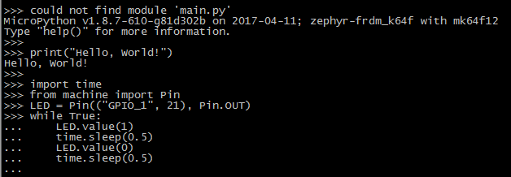

# 实验 - 利用 Zephyr 运行 Python

通常来说，绝大多数嵌入式开发人员都不会 JavaScript，因为这是纯前端的脚本语言（现在还包括桌面了），但是却有一部分嵌入式开发人员会 Python，或者说略懂 Python 语法，因为在我们的日常工作中也可能遇到（比如 Zephyr 的仓库中就有大量的 shell 脚本和 python 脚本）。

MicroPython 是一个 Python 解释器，主要应用于小型嵌入式设备中，可以兼容 Python 3.x 的语法。非常幸运的是，MicroPython 在去年就开始支持 Zephyr OS 了。

MicorPython 的源码位于：[https://github.com/micropython/micropython](https://github.com/micropython/micropython)。

## 获取源码

直接通过 git 克隆：
```
$ git clone https://github.com/micropython/micropython.git
```

## 编译

MicroPython 也依赖于 Zephyr 代码库，但是我们可以直接使用我们之前一直在使用的代码。

先进入 Zephyr 代码所在目录，然后执行 source 操作：
```
$ source zephyr-env.sh 
```
然后进入我们刚刚下载的 MicroPython 代码所在目录，然后进行编译：
```
$ cd micropython 
$ cd zephyr 
$ make BOARD=frdm_k64f
```

编译完成后，会生产二进制镜像文件`micropython/zephyr/outdir/frdm_k64f/zephyr.bin`。

## 实验现象

将 zephyr.bin 烧写到开发板上后，对板子复位，然后可以看到串口打印：

<center></center>

<center>图. Python 的 REPL 环境</center>

这不就是 Python 的 REPL 环境嘛，我们可以直接在里面执行 python 语句。

### Hello World

Python 版的 Hello World 来啦，我们直接输入：
```
print("Hello, World!")
```
然后可以看到，该语句被执行了：

<center></center>

<center>图. Hello World</center>

### LED 闪烁

来个高级点的 —— LED 跑马灯，程序源码：
```
import time
from machine import Pin

LED = Pin(("GPIO_1", 21), Pin.OUT)
while True:
    LED.value(1)
    time.sleep(0.5)
    LED.value(0)
    time.sleep(0.5)
```

<center></center>

<center>图. LED 闪烁</center>

程序执行结果：LED 每秒闪烁一次！

## 总结

虽然都是脚本语言，但是 JavaScript 和 Python 在 Zephyr 上的表现是不同的。JavaScript 是在编译时就将 JS 脚本给解释了，Python 是直接将整个镜像做成一个解释器，在运行时解释 python 语句，二者各有自己的优势：
- JavaScript，由于在编译时解释，程序执行效率高
- Python，在运行时解释，可以在运行时编写脚本并运行，非常灵活

