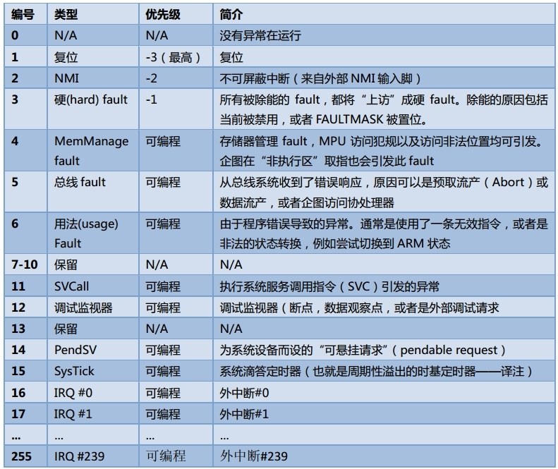

.. boot-asm:

.. highlight:: c
   :linenothreshold: 1

系统启动 - 汇编部分
============================

不同架构的 CPU 在启动时会略有差别，我们统一以 cortex-m3 为例。

茫茫数万行代码，从哪儿入手？通常，CPU 在上电后会发生一个复位异常，此时硬件内部会自动查找异常向量表，然后在该表中查找到复位向量，然后跳转到对应的函数中开始执行。

如果时间充裕，建议阅读阅读《Cortex-M3 权威指南》一书，它里面对这一块讲解得比较清楚。

.. contents::
   :depth: 3
   :local:
   :backlinks: top

向量表
****************************

cortex-m3 的异常/中断向量表如下图所示：

它包括两部分，1-15 为异常向量表，16-255 为中断向量表。

异常向量表
----------------------------

cortex-m3 的异常向量表所在的源文件是 `arch/arm/core/cortex-m/vector_table.s`，整个文件的源码如下(忽略部分不相关的东西)： ::

  GDATA(_main_stack)
  
  SECTION_SUBSEC_FUNC(exc_vector_table,_vector_table_section,_vector_table)
  
      .word _main_stack + CONFIG_MAIN_STACK_SIZE
  
      .word __reset
      .word __nmi
  
      .word __hard_fault
  #if defined(CONFIG_CPU_CORTEX_M0_M0PLUS)
      ...
  #else /* CONFIG_CPU_CORTEX_M3_M4 */
      .word __mpu_fault
      .word __bus_fault
      .word __usage_fault
      .word __reserved
      .word __reserved
      .word __reserved
      .word __reserved
      .word __svc
      .word __debug_monitor
  #endif
      .word __reserved
      .word __pendsv
  #if defined(CONFIG_CORTEX_M_SYSTICK)
      .word _timer_int_handler
  #else
      ...
  #endif
  
GDATA(_main_stack) 的作用是做一个申明，类似于 C 语句中的 extern 关键字，我们不必深究，只需要知道它表示 _main_stack 是一个全局的符号，且存放于数据段。

SECTION_SUBSEC_FUNC(exc_vector_table,_vector_table_section,_vector_table) 表示 _vector_table 是一个符号，且该符号属于 exc_vector_table 这个段中的 _vector_table_section 子段。我们可以简单地将 SECTION_SUBSEC_FUNC() 理解为实现了一个函数。 

.. Hint::

  符号是什么？它表示一个地址。比如我们写了一个 C 函数 test()，则编译器在汇编阶段会根据这个函数名生成一个符号 test(假设叫做 test，实际的符号名可能是xxx_xxx_test)，而这个符号的后面会紧跟着该函数的代码，当其它代码需要调用该函数时，会使用跳转指令 bx test，然后就会执行该函数的代码了。所以，符号的本质是一个地址，而该地址处存放着可以执行的代码(指令)。

后面的形式都是固定，都是 .word xxxx。其中，.word 是一个汇编伪指令，表示后面的符号的类型是 word；xxxx 表示一个符号(第一个 _main_stack + CONFIG_MAIN_STACK_SIZE 除外)，当发生对应的异常时，都会跳转到该符号(即地址)对应的代码处执行。

当 CPU 上电后会发生复位异常，即会跳转到 __reset 符号处继续执行，所以我们会继续分析 __reset 处的代码。

中断向量表
---------------------------

cortex-m3 的中断向量表所在的源文件是 `arch/arm/core/cortex-m/irq_vector_table.s`。系统启动时不会涉及到这一块，略。

__reset
****************************

__reset 这“函数”的实现在 `arch/arm/core/cortex-m/reset.S` 中： ::

  GTEXT(__reset)
  GTEXT(memset)
  GDATA(_interrupt_stack)
  
  SECTION_SUBSEC_FUNC(TEXT,_reset_section,__reset)
  
      /* 锁定中断 */
  #if defined(CONFIG_CPU_CORTEX_M0_M0PLUS)
      ...
  #else /* CONFIG_CPU_CORTEX_M3_M4 */
	  /* 直接将中断优先级 _EXC_IRQ_DEFAULT_PRIO 写入中断屏蔽寄存器 BASEPRI
	   * 所有优先级高于 _EXC_IRQ_DEFAULT_PRIO 的中断都会被屏蔽 
	   **/
      movs.n r0, #_EXC_IRQ_DEFAULT_PRIO
      msr BASEPRI, r0
  #endif
  
  #ifdef CONFIG_WDOG_INIT
      /* 初始化看门狗，略 */
      bl _WdogInit
  #endif
  
  #ifdef CONFIG_INIT_STACKS
      /* 初始化中断栈空间，在汇编里面使用寄存器传递参数，
	   * r0 对应于 memset 的第一个参数
	   * r1 对应于 memset 的第二个参数
	   * r2 对应于 memset 的第三个参数
	   * 注意到，栈空间的初始化值是 0xaa，而不是 0x0
	   **/
      ldr r0, =_interrupt_stack
      ldr r1, =0xaa
      ldr r2, =CONFIG_ISR_STACK_SIZE
      bl memset
  #endif
  
      /*
       * Set PSP and use it to boot without using MSP, so that it
       * gets set to _interrupt_stack during nanoInit().
       */
	  /* 先将 PSP “指向” 栈顶(栈的起始地址+栈空间大小) */
      ldr r0, =_interrupt_stack
      ldr r1, =CONFIG_ISR_STACK_SIZE
      adds r0, r0, r1
      msr PSP, r0
	  /* 然后再使能 PSP 寄存器 */
      movs.n r0, #2	/* switch to using PSP (bit1 of CONTROL reg) */
      msr CONTROL, r0
  
	  /* 跳转到 _PrepC 函数处继续执行 */
      b _PrepC

GDATA()、GTEXT() 都是对符号的申明，不再赘述。

SECTION_SUBSEC_FUNC(TEXT,_reset_section,__reset) 表示后面的代码属于 __reset() “函数”。

总结
****************************

CPU 在上电后做了如下几件事儿：

* 查找向量表，并跳转到复位向量的入口处继续执行
* 锁定中断
* 初始化看门狗(如果有需要)
* 初始化中断栈空间(如果有需要)
* 将栈指针 PSP 指向中断栈空间的顶部
* 跳转换到 _PrepC，继续为运行 C 环境做准备

