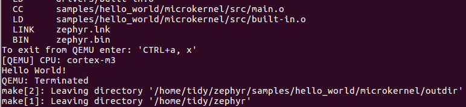

.. hello:

.. highlight:: c
   :linenothreshold: 1

Hello World
============================

Zephyr OS 的开发环境支持三大平台：

* Windows
* Linux 
* Mac

建议使用 Linux 平台搭建环境。我们后面的所有文章都以 Ubuntu 作为开发环境。

安装依赖的包
******************************

先将系统更新到最新状态： ::

  $ sudo apt-get update

再安装依赖的包： ::
 
  $ sudo apt-get install git make gcc gcc-multilib g++ libc6-dev-i386 \
  g++-multilib python3-ply

.. Hint::

  如果你的系统是 32 位的，不需要安装 libc6-dev-i386 这个包。

安装 SDK
******************************

访问 `Zephyr SDK archive <https://nexus.zephyrproject.org/content/repositories/releases/org/zephyrproject/zephyr-sdk/>`_ 下载最新版 SDK 。

.. Hint::
 
  国外的服务器，有时候慢到吐血，我已经将最新版上传到百度云了。请到这个帖子下载最新的 SDK： `zephyr sdk 百度云下载路径 <http://www.96boards.net/forum.php?mod=viewthread&tid=54&extra=page%3D1>`_。

下载完成后，运行该文件： ::

  $ chmod +x zephyr-sdk-0.8.2-i686-setup.run
  $ sudo ./zephyr-sdk-0.8.2-i686-setup.run

默认会将 SDK 安装到/opt/zephyr-sdk/目录下。个人推荐使用默认设置。

执行下列命令将环境变量导出到 `~/.zephyr` 文件： ::

  $ cat <<EOF > ~/.zephyr
  export ZEPHYR_GCC_VARIANT=zephyr
  export ZEPHYR_SDK_INSTALL_DIR=/opt/zephyr-sdk
  EOF

获取 Zephyr 源码
******************************

Zephyr 的源码托管在 Linux 基金会的 Girret 服务器上，同时在 GitHub 上也有一个仓库镜像。在国内访问它的 Girret 服务器比较慢，建议直接从 GitHub 上下载： ::

  $ git clone https://github.com/zephyrproject-rtos/zephyr.git

默认会克隆 master 分支的代码。

编译 hello-world
******************************

进入 Zephyr 项目目录，先配置环境变量： ::

  $ cd zephyr
  $ source zephyr-env.sh

进入 hello-world 目录，编译： ::

  $ cd samples/hello_world/microkernel
  $ make

上面的 make 命令会使用应用程序的 Makefile 文件中定义的默认设置编译 hello_wolrd 例程。你可以定义环境变量 BOARD 为所支持的其它板子编译应用，例如：make BOARD=arduino_101。关于 make 命令的具体使用方法可以执行 make help。

编译后会生成镜像文件 zephyr.bin，它位于当前目录下的 samples/xxx/ 下面，其中 xxx 表示你所编译的板子。

使用 QEMU 仿真
******************************

Zephyr 支持在 x86 和 ARM Cortex-M3 两种架构下使用 qemu 进行仿真。

仿真 x86： ::

  $ make BOARD=qemu_x86 qemu

仿真 ARM Cortex-M3： ::

  $ make BOARD=qemu_cortex_m3 ARCH=arm qemu

仿真结果： 

.. Hint::
  
  退出仿真界面的方法：先按 CTRL+a，再按 x。
